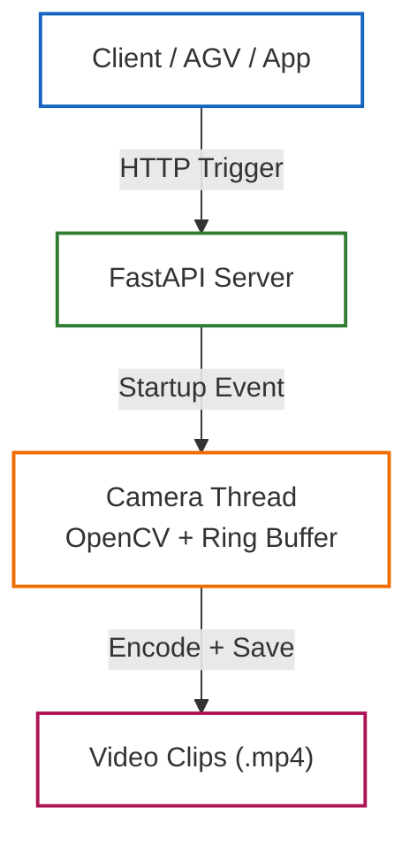
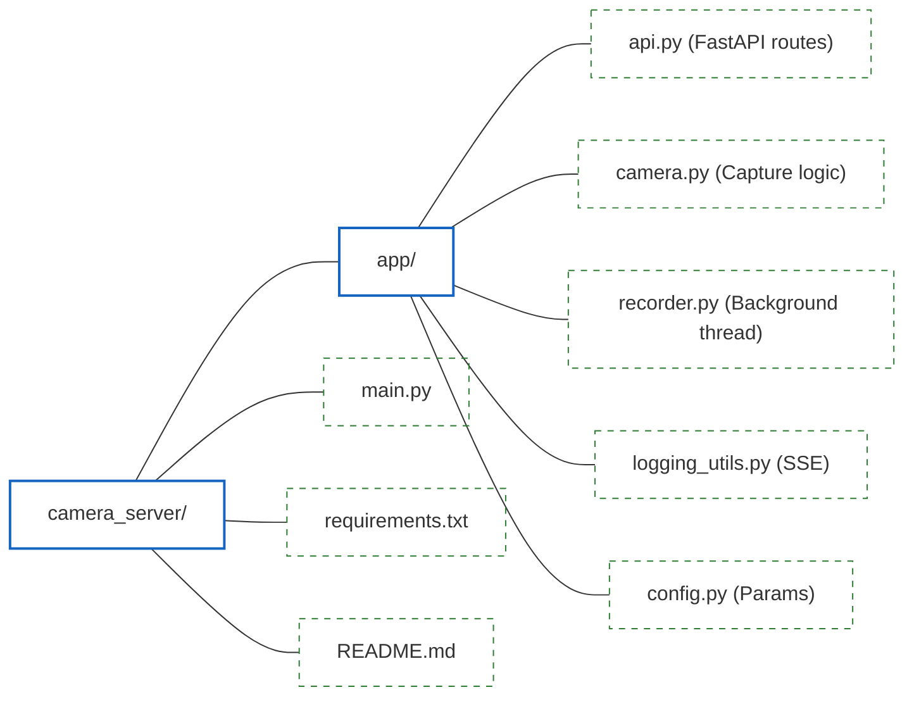

# Camera Pre/Post Trigger Server

A lightweight **FastAPI-based camera server** designed to manage a persistent camera thread and record **short pre-trigger and post-trigger video clips**.

The system is optimized for **embedded / edge devices** (Raspberry Pi, RockPi, industrial PCs) and supports **HTTP triggering**, **background recording**, and **real-time log streaming** via **Server-Sent Events (SSE)**.

---

## Architecture Overview

---

## Features

- Persistent camera lifecycle managed by FastAPI lifespan
- Pre-trigger and post-trigger recording
- Background recording thread (non-blocking API)
- OpenCV-based capture and encoding
- HTTP trigger endpoint
- Real-time log streaming via Server-Sent Events (SSE)
- Minimal HTML log viewer
- Thread-safe logging using `queue.Queue`
- Clean startup and shutdown handling
- Suitable for headless devices and `systemd` deployment

---

## Project Structure
---

---

## Requirements

- Python **3.10 – 3.11** (recommended)
- FastAPI
- Uvicorn
- OpenCV (`cv2`)

> ⚠️ Python 3.13 is not recommended yet due to OpenCV wheel compatibility.

---

## Quick Start (Windows / PowerShell)

### Create virtual environment

```powershell
python -m venv .venv
.venv\Scripts\Activate.ps1
--- 
## Install dependencies
```powershell 
pip install -r requirements.txt
---


